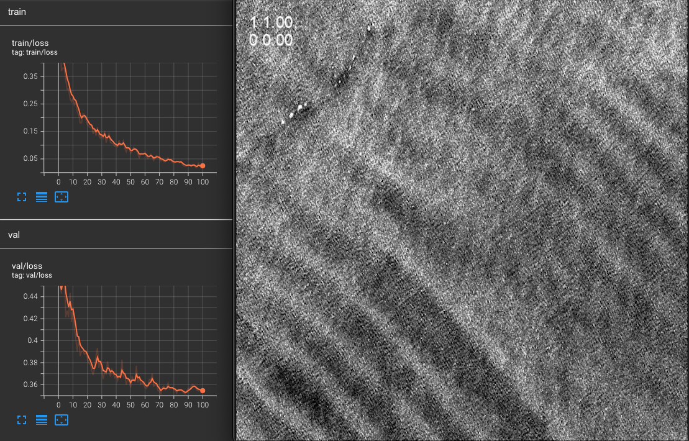

# internal_waves_yolo

## About

A jupyter notebook created to solve the AIR Centre's Kaggle competition about Automatic Identification of Internal Waves:

***internal_waves_yolo.ipynb*** - Main notebook that prepares the internal waves dataset, trains a YOLOv8 model and performs classification. 


## Setup and Run

**Download API:**

1. Go to Your Profile in Kaggle;
2. Go to Settings;
3. In Account, scroll to API and Create New Token;
4. Click Continue;
5. Save kaggle.json inside a /home/user/.config/kaggle (might change according to OS);
6. Click [here](https://www.kaggle.com/discussions/general/156610) for more info.

**Create an Anaconda environment:**

```
conda create -n internal_waves_yolo-env python=3.10
conda activate internal_waves_yolo-env
pip install ultralytics==8.2.82
pip install tensorflow==2.16.2
pip install -U scikit-learn==1.5.1
pip install kaggle==1.6.17
```
**or use Colab:**

<!-- https://openincolab.com -->

***internal_waves_yolo.ipynb***<br>
<a target="_blank" href="https://colab.research.google.com/github/EmanuelCastanho/internal_waves_yolo/blob/main/internal_waves_yolo.ipynb">
  
</a>


## Example

A model based on YOLOv8x trained for 100 epochs is provided on request (113MB).




## References

- **YOLOv8:** Jocher, G., Chaurasia, A., & Qiu, J. (2023). Ultralytics YOLO (Version 8.0.0) [Computer software]. https://github.com/ultralytics/ultralytics
- **AIR Centre Kaggle Competition:** Joao Pinelo, Adriana Santos-Ferreira, César Capinha, José da Silva. (2024). Automatic Identification of Internal Waves. Kaggle. https://kaggle.com/competitions/internal-waves
